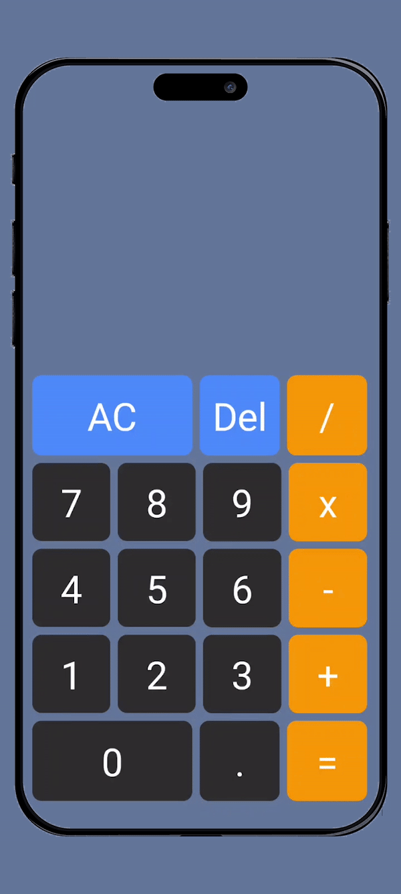

# JETPACK COMPOSE CALCULATOR . 🔥

[](https://www.android.com)

Jetpack Compose Calculator: Sleek UI, Efficient State Handling

## Preview - Calculator App 🌟🌟🌟



## About

📱✨ Introducing My Android Calculator Built with Jetpack Compose! Featuring a sleek UI design, this calculator utilizes state management to store user inputs and track the last input for seamless calculations. Experience the convenience of modern UI and efficient state handling in this innovative app. 🚀🔢

## State

I used the state where I can access my first number second number and the third number and operation.
output = number1+operation+number2
Third number will just store the last calculation to show it on the top .

### states

```
/** calculator state **/
data class CalculatorState(
    val number1: String = "",
    val number2: String = "",
    val operation: CalculatorOperation? = null,
    val number3:String= ""
)

```

### calculate operations

```

/** different operations for calculate operations **/
sealed class CalculatorOperation(val symbol: String) {
    data object Add: CalculatorOperation("+")
    data object Subtract: CalculatorOperation("-")
    data object Multiply: CalculatorOperation("x")
    data object Divide: CalculatorOperation("/")
}

```

### Button Composable

```
@Composable
fun CalculatorButton(
    symbol: String,
    modifier: Modifier = Modifier,
    color: Color = Color.White,
    textStyle: TextStyle = TextStyle(),
    onClick: () -> Unit
) {
    Box(
        contentAlignment = Alignment.Center,
        modifier = Modifier
            .clip(RoundedCornerShape(10.dp))
            .background(color)
            .clickable {
                onClick()
            }
            .then(modifier)
    ) {
        Text(
            text = symbol,
            style = textStyle,
            fontSize = 36.sp,
            color = Color.White
        )
    }
}

```
